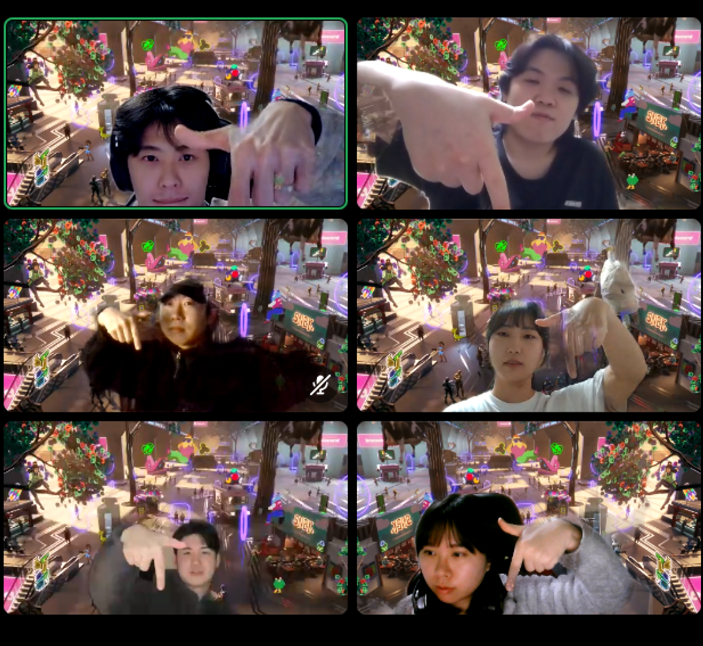

# [1주차] Project_7팀 진행 상황 공유

## 팀 구성원, 개인 별 역할

---

**김진기** : (팀장)

- 아이디어 해커톤 자료 제작 , 발표
- 게시판 제작 및 댓글 기능 구현, 최종 발표

**김창서** : (팀원)

- 게시판 제작 및 댓글 기능 구현

**윤준혁**: (팀원)

- 웹 메인 페이지 제작, 로그인 페이지 제작 및 회원 관리

**이다혜** : (팀원)

- DB 설계 (메인), 게시판 제작 및 댓글 기능 구현 (서브)

**이재우**: (팀원)

- 웹 메인 페이지 제작, 로그인 페이지 제작 및 회원 관리

**조성은**: (팀원)

- 웹 메인 페이지 제작, 로그인 페이지 제작 및 회원 관리
- 노션 일일 회고록 작성

## 팀 내부 회의 진행 회차 및 일자1회차(2024.01.10) 구글 밋 진행, (OOO님 불참)

---

1회차(2024.01.15) 아이디어 회의, 참고자료 조사

2회차(2024.01.16) 아이디어 수정,  참고자료 조사

3회차(2024.01.17) 강사님 피드백, 피그마 프로토 타입 제작

4회차(2024.01.18) 아이디어 해커톤 발표자료 작성 및 수정!

5회차(2024.01.19) 아이디어 해커톤 발표!

## 현재까지 개발 과정 요약 (최소 500자 이상)

---

### 김진기

- 아이디어톤 발표 자료 준비
- 프로젝트 역할 분담 및 세부 사항 조정
- 깃 프로젝트 생성
- 프로젝트에 필요한 기술 조사
- 팀 기획서 작성

### 김창서

- 아이디어 회의 참여
- 피드백 이후 아이디어 수정및 보안 참여
- 게시판 및 댓글 구현을 위한 Jump to Spring Boot 복습

### 윤준혁

- 아이디어 회의 참여

### 이다혜

- erd 설계
- 프로젝트 기본 세팅
- 프론트 layout 작성

### 이재우

- 아이디어 회의 참여
- Github flow 협업 공부
- 점프투스프링부트 복습

### 조성은

- 피그마 프로토타입 제작
- 아이디어톤 발표자료 수정

## 개발 과정에서 나왔던 질문 (최소 200자 이상)

---

1. 커뮤니티 게시판 기능 위주로 먼저 개발 후  -> 위치 서비스는 고도화작업 으로 추가 작업 하기
   - 프론트 뭐 할지 정하기
   - 깃헙 플로우 고민해보기 (강사님 추천)
   - 타임리프 , 스벨트킷, vue.js 프론트 선택 고민하기
    
   ---

2. 기술 스택 정리하기
   - 백엔드 : java, spring boot, gradle, lombok, junit5, spring data JPA, H2, Spring-Security
   - 프론트 엔드 : html, css, bootstrap, javascript
   - 협업툴 : git, github, figma
    
     ---

3. 개발하기 전 수정
   - 게시글 등록 + 수정
   - 게시글 리스트 + 검색
   - 게시글 상세페이지 + 댓글
   - 카테고리, 태그 중 뭐 선택? -> 카테고리
   - 역할 세부적으로 정하기
    
     ---

4. 프론트 고민
   - 타임리프 하더라도 부분적으로 vue.js 사용 추천 받음
    
     ---

5. 그라운드 룰 추가 수정
   - 작업 시작 전 to-do-list 작성 및 공유 하기

## 개발 결과물 공유

---

Github Repository URL: https://github.com/TECHIT-Traveler

